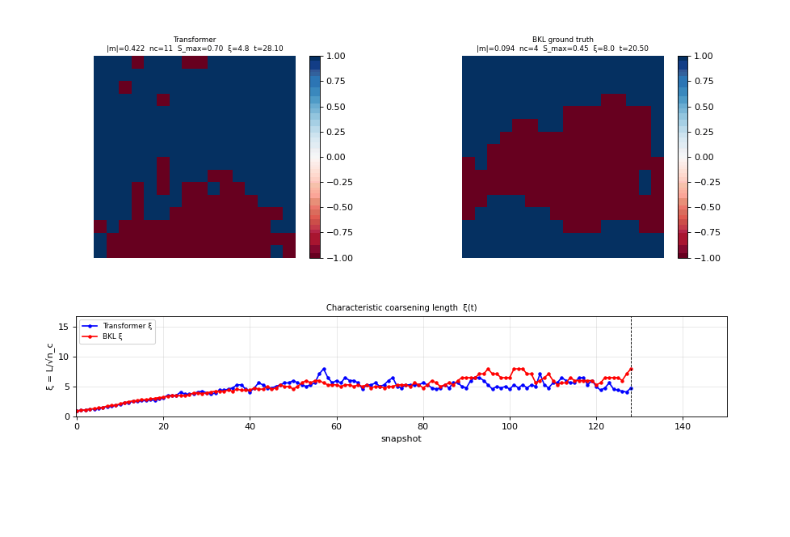

<!-- _class: center -->

# Learning Ising Dynamics with a Transformer

**Project motivation for the Marin rebuild**

<br>

Why this problem, the scientific bet, and how we tokenize it

<br>

<span style="font-size:20px; color:#777">Assumes ML fluency — no statistical physics background needed</span>

---

# Phase transitions are everywhere

Matter reorganizes itself **abruptly** when you turn one knob (temperature):

- **Ice → water** — an *ordered* crystal melts into a *disordered* liquid
- **A magnet heated past its Curie point** loses its magnetism — aligned atomic spins *disorder* and the magnetization collapses to zero
- Boiling, alloys ordering, superconductivity switching on...

Wildly different microscopically, yet they share **universal** behavior near the transition — the same critical exponents independent of the material.

> A phase transition is a *qualitative* change of state at a sharp critical point. Understanding when and how order gives way to disorder is one of the central problems of condensed-matter physics.

---

# 1. Why the Ising model

The **hydrogen atom of statistical physics** — the simplest system with a real **phase transition**. It is the **minimal model of a ferromagnet**: each $s_i = \pm 1$ is an atomic magnetic moment, neighbors prefer to align, and net alignment = magnetization.

$$H = -J \sum_{\langle ij \rangle} s_i s_j \qquad (J = 1)$$

One knob — temperature $T$ — drives a sharp **order → disorder** transition at the Curie point $T_c \approx 2.269$ (known **exactly**, Onsager 1944): cold and magnetized below, hot and demagnetized above.

---

# The two phases


The same 16×16 lattice at low vs high $T$: cold and aligned ($|m|\approx 1$, left) vs hot and random ($|m|\approx 0$, right). One temperature knob moves you between them.

---

# Why it's the right testbed

The two phases differ sharply in structure and dynamics:

| | Ordered ($T < T_c$) | Disordered ($T > T_c$) |
|---|---|---|
| Spins | mostly aligned, $\|m\|\approx 1$ | random, $\|m\|\approx 0$ |
| Correlation length $\xi$ | grows | short |
| Dynamics | rare boundary flips | fast, uniform |

---

# Why it's the right testbed (cont.)

- **Exact ground truth** — simulate the true dynamics exactly → an analytic loss floor (in nats) to measure the model against.
- **Difficulty has a known knob** — physics gets hard near $T_c$. We generate data *only far from $T_c$*, so the critical region is a held-out generalization test.
- **Next-token prediction in disguise** — the data is a stream of discrete events; no physics-specific architecture needed.

> The bet: if a transformer learns statistical mechanics from event streams, NTP is capturing *dynamical laws*, not surface statistics.

---

# 2. The scientific claim

We train under deliberately **narrow, easy** conditions and ask the model to extrapolate to **hard, qualitatively different** physics it never saw.

**Train on (easy):** equilibrium only · far from $T_c$ (bands $[1.5,2.0]$ & $[2.8,3.5]$, critical region *excluded*) · fixed $T$ per trajectory.

**Predict zero-shot (hard):** non-equilibrium **quenches** (hot config → cold $T$ → **coarsening**, domains grow) · **near-critical** behavior · time-varying $T$ schedules — *none seen in training*.

<br>

**Why it's free at inference:** the temperature token is re-emitted before *every* event, so we can swap $T$ mid-sequence — quench, ramp, any schedule — with **zero architectural change**.

---

# Why this could work

Ground truth comes from **BKL** (Bortz–Kalos–Lebowitz) rejection-free kinetic Monte Carlo:

$$w_i = \min(1,\, e^{-\Delta E_i / T}), \qquad R = \sum_i w_i, \qquad \Delta t \sim \text{Exp}(R)$$

Flip site $i$ w.p. $w_i / R$. Output = clean continuous-time stream of **(position, $\Delta t$)** pairs.

<br>

> **BKL is Markov:** the next flip depends only on the current local config and $T$ — never on history.

<br>

If the model learns the **local rate law** (not memorized trajectories), then quenches and near-critical dynamics fall out for free — they're the same local rule applied to states equilibrium rarely visits.

**Thesis: learn the local rule from easy data → get the hard non-equilibrium dynamics as emergent generalization.**

---

# Proof of life — it reproduces the kinetics



<span style="font-size:22px">Same disordered start at $T=1.7$: the transformer (blue) tracks exact BKL (red) across $\xi(t)$, $|m|$, $E/N$, domain walls, and clusters.</span>

---

# Why that result matters

- **It's out-of-distribution.** Training was equilibrium only — a coarsening transient (domains nucleating and growing) is dynamics the model *never saw*. Yet it reproduces the kinetics, not just static equilibrium.

- **The thesis, in evidence.** Learn the local Markov rule from easy data → get the harder non-equilibrium relaxation (nearly) for free.

- **Frontier.** Larger far-from-$T_c$ quenches ($3.5\!\to\!1.5$) are still *not* captured well — the headline open problem for the rebuild.

- **Caveat.** This used a tuned sampling temperature of **0.7**. Sampled as-is (temp 1.0) the model runs **too hot / too random** and over-produces flips — calibrating sampling is part of the work.

---

# 3. Tokenization is the experiment

Model is a plain decoder-only transformer. **All the physics lives in how we serialize a trajectory into tokens.** Three grammars so far.

**Shared vocab (~340 tokens):** temperature bins, spin up/down, one position token per site ($0..L^2-1$), log-binned $\Delta t$ tokens.

<br>

> **Shared invariant — config tokens are never prediction targets.**
> The configuration is a *deterministic* function of past flips, so the model only ever predicts `[pos]` and `[dt]`. The config is *reconstructed* by applying predicted flips, never sampled. Loss is masked to event tokens only.

---

# Encoding time — the $\Delta t$ tokens

Each event has a continuous waiting time $\Delta t \sim \text{Exp}(R)$, and $R$ spans orders of magnitude (cold → large $\Delta t$, hot → small). So we **log-bin** it:

- Pool all $\Delta t$ from data, clip to the $[0.1, 99.9]$ percentiles → range $[\text{lo}, \text{hi}]$.
- **64 log-uniform interior bins** + 1 **underflow** + 1 **overflow** → 66 $\Delta t$ tokens. Log spacing ≈ even occupancy across bins.
- Encode: a real $\Delta t$ → the bin it falls in.

**At inference — recover continuous time from a discrete token:**

1. Model emits a categorical over the 66 bins → sample one (with sampling temperature).
2. Draw $\Delta t$ **log-uniformly within that bin**: $\Delta t = \exp\big(\text{Uniform}(\log\text{lo},\, \log\text{hi})\big)$ — preserves the right *variance* (a bin-center would collapse it).

Cumulative $\textstyle\sum \Delta t$ = the physical clock.

---

# v1 — explicit config snapshot (works today)

Slice each trajectory into **windows** of $W$ events. Each window:

```
[T_bin]
[pos][spin] × N            ← current config  (copy 1, context)
[pos][spin] × N            ← current config  (copy 2, given)
[T_bin][pos_k][dt_k] × W   ← the W events to predict
```

- Re-injecting the config every $W$ events is **compaction**: it bounds context length (instead of carrying the whole flip history) while handing the model an explicit current-state snapshot — and yields 10× more training windows.
- Config **duplicated** so the model sees the full state before predicting (no raster-order bias under the causal mask).
- `T_bin` repeated before every event → temperature signal always ≤2 tokens away, and this is what enables inference-time quenches.

---

# v1 results — within 0.3% of optimal


<span style="font-size:21px">Val loss sits **~0.012 nats (0.3%)** above the oracle floor. The residual gap is **96% in the position token** (*which* site flips) and **peaks near $T_c$** — an attention-routing failure: the model searches a ~1000-token config for the lattice topology.</span>

<span style="font-size:18px; color:#777"><b>NLL</b> (negative log-likelihood): per token $-\log p_\text{model}(\text{actual})$, averaged → cross-entropy in nats. It <i>is</i> the val loss; lower = better, oracle = its minimum.</span>

---

# The oracle — an exact loss floor

The **oracle** = the true generating process (BKL with exact rates). It is the information-theoretic floor: cross-entropy is minimized when your model *is* the true conditional, so **nothing can score below it**. Subtracting it removes the irreducible thermal noise and leaves only what the model failed to learn.

At each event it assigns probabilities **token-identically to the model**:

$$p_\text{oracle}(\text{pos}=j) = \frac{w_j}{R}, \qquad
  p_\text{oracle}(\Delta t \in \text{bin } k) = e^{-R\,\text{lo}_k} - e^{-R\,\text{hi}_k}$$

$\text{lo}_k, \text{hi}_k$ are the lower/upper **time edges** of $\Delta t$-bin $k$. Since waiting times are $\text{Exp}(R)$ with survival $P(\Delta t > t)=e^{-Rt}$, the bin mass is just $P(\Delta t>\text{lo}) - P(\Delta t>\text{hi})$.

---

# The gap = model − oracle

The oracle NLL is computed through the **exact same pipeline** as the model:

- same tokenized windows, same loss mask (pos + dt tokens only),
- same averaging over the $2W$ event tokens, same held-out test split,
- rates updated after every flip.

So both numbers are in identical units, and:

$$\textbf{gap} = \text{model val loss} - \text{oracle NLL} \quad (\text{nats / token})$$

A **noise-subtracted, apples-to-apples** measure of headroom, splittable into pos- vs dt-token contributions — this is how we compare v1 / v2 / v3.

---

# v2 — inject the graph (in progress)

The pos-token gap peaks near $T_c$ → the model is failing to *find* the lattice topology. So hand it over: prepend the **edge list**, represent the config sparsely.

```
[edge_start] [pos_A][pos_B] × #edges [edge_end]   ← topology, given
[config_start] [pos_i] × n_up [config_end]        ← sparse config
[T_bin][pos_k][dt_k] × W                          ← events
```

- Don't make the model *rediscover* the neighbor graph from statistics — **hand it the topology as tokens**.
- `[edge_start]/[edge_end]` delimiters → **zero-shot transfer to smaller lattices** (pos vocab for $L=8$ is a subset of $L=16$).
- Per-event `T_bin` is kept — it's what lets us run **quenches/ramps** at inference (swap $T$ mid-sequence).

---

# v2 vs. prior graph-in-transformer work

Two camps for getting topology into a transformer — **v2/v3 are squarely in the second:**

- **Architectural camp** — **Graphormer** (shortest-path biases in attention scores), **GPS** (message passing + positional encodings on embeddings). Bakes the graph into the model. GPS argues plain transformers *can't* recover local structure without it.
- **Token/serialization camp** — **TokenGT** (*"Pure Transformers are Powerful Graph Learners"*: nodes + edges as tokens to a vanilla transformer, proven ≥ all message-passing GNNs), **"Talk like a Graph"** (edge lists as text to an LLM). Architecture untouched; graph goes in **as tokens**.

So the method is **not novel and not contrary to the field** — TokenGT already showed token-only works. We're in that camp; the **new part is the application**: token-serialized topology for autoregressive **lattice *dynamics*** (kinetics), not static graph prediction.

> **Inherited lesson:** TokenGT and "Talk like a Graph" both find the *encoding* is decisive (node identifiers; ~60% swings from serialization). v2's "just prepend the adjacency" may need structural signal on the tokens to crack $T_c$ — not raw edges alone.

---

# v3 — event-local neighbor injection (planned)

After each flip, inject **only its neighbors** before the next event:

```
[T_bin][pos_k][dt_k][nbr_1][nbr_2][nbr_3][nbr_4]
```

- Directly encodes the BKL invariant — after a flip, only that site + neighbors need rate updates.
- Sequences shrink **~1200 → ~500 tokens**; edge list dropped entirely.
- Generalizes cleanly to 3D ($d=6$) and arbitrary graphs at $O(d)$ per event.

---

<!-- _class: center -->

# TL;DR for the rebuild

<div style="text-align:left; max-width:900px; margin:auto">

1. **Ising** = exactly-solvable testbed with a real phase transition and free, exact ground truth.

2. **The claim:** train easy (equilibrium, far from $T_c$, fixed $T$) → generalize zero-shot to hard (quenches, near-critical). Works *if* NTP learns the **local Markov rule**, not the trajectories.

3. **Tokenization is the experiment.** v1 (config snapshot) → 0.3% of optimal; v2 (inject the graph) and v3 (inject local neighbors) attack the residual spatial-routing gap near $T_c$.

</div>

<br>

<span style="font-size:20px; color:#777">Full notes & references (GNS, NequIP, MACE, Wu et al. PRL 2019, Graphormer, GPS, TokenGT, Talk like a Graph) in <code>AGENTS.md</code> and <code>MOTIVATION.md</code>.</span>
