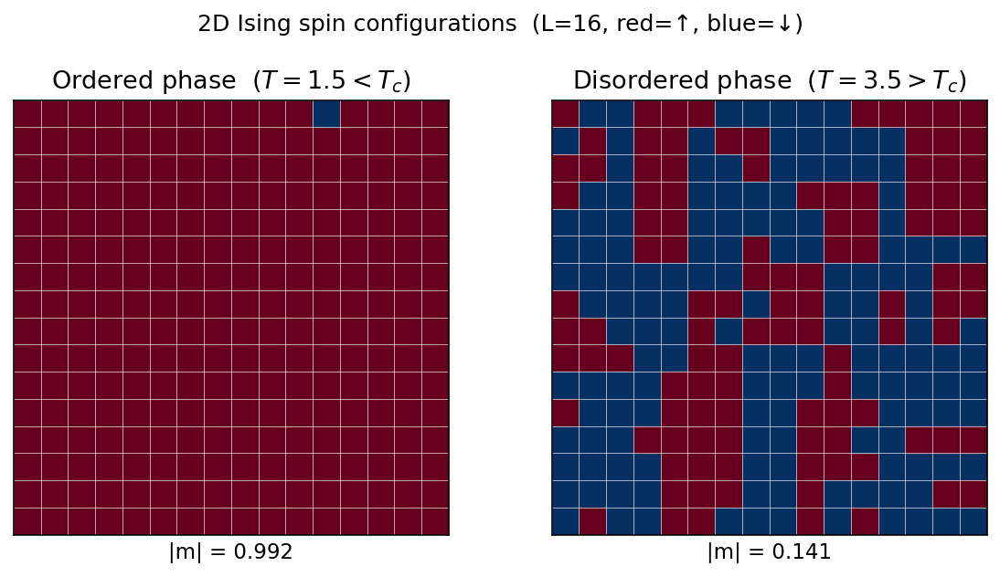
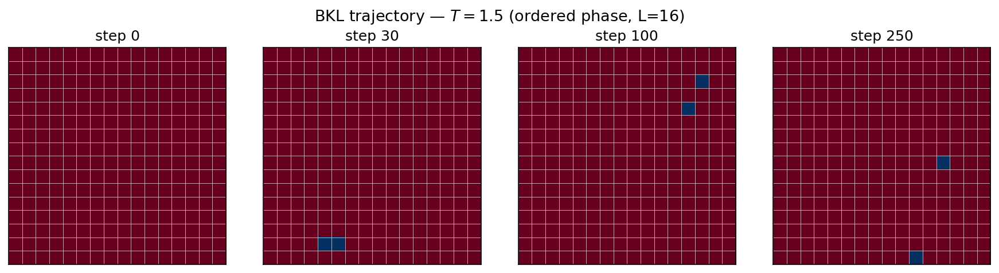
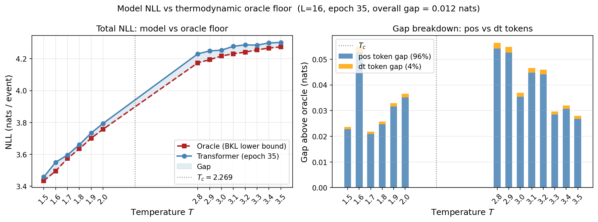
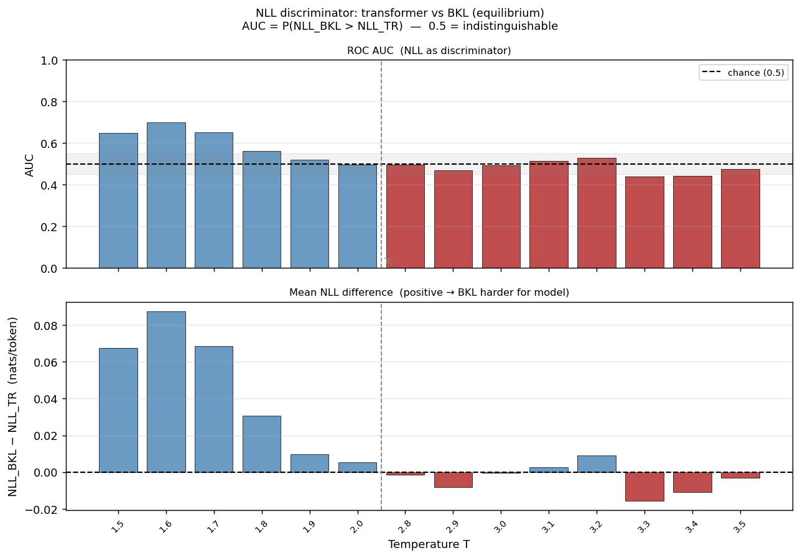
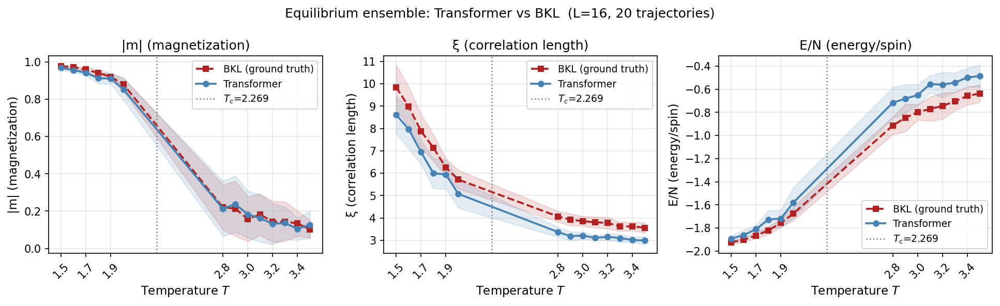
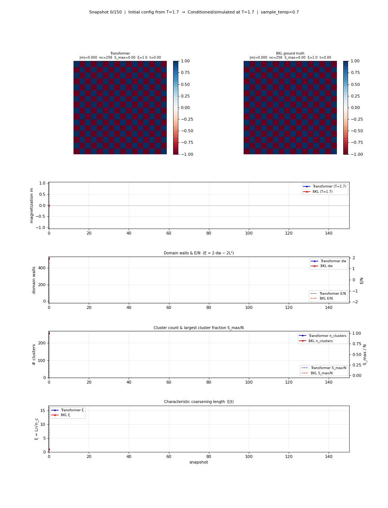

<!-- _class: center -->

# Learning Ising Kinetics with a Transformer

**Can a language model learn the rules of statistical mechanics?**

<br>

Next-token prediction on spin flip events

---

# The Ising Model

Spins ±1 on a 2D square lattice: $H = -J \sum_{\langle ij \rangle} s_i s_j$ (J=1, k_B=1)



Two phases separated by a phase transition at $T_c \approx 2.269$ (Onsager exact)

---

# Dynamics: BKL Trajectory

Each spin has a Metropolis flip rate $w_i = \min(1,\, e^{-\Delta E_i/T})$. Total rate $R = \sum_i w_i$.

At each step: draw $\Delta t \sim \text{Exp}(R)$, select spin $\propto w_i$, flip it.



**No rejected moves** — pure continuous-time event sequence: $(position,\ \Delta t)$ pairs

---

# The Goal

> **Train a transformer to generate statistically valid Ising spin flip trajectories, conditioned on temperature.**

<br>

- **Given:** current spin configuration + temperature $T$
- **Predict:** which spin flips next, and when

**Why NTP / language model framing?**
- Zero physics-specific architecture — pure sequence modeling
- If it works, the model has implicitly learned the Metropolis rate distribution
- Ground truth is exact and cheap to evaluate at every step

Dataset: **42,000 trajectories** × 500 events at 3 sizes × 14 temperatures

---

# The Grammar

Each window of $W=50$ events → one training sequence (L=16, **1175 tokens total**):

```
[T_bin]
[pos_0][spin_0] [pos_1][spin_1] ... [pos_255][spin_255]     ← spin config (copy 1)
[pos_0][spin_0] [pos_1][spin_1] ... [pos_255][spin_255]     ← spin config (copy 2)
[T_bin][pos_k][dt_k]  [T_bin][pos_{k+1}][dt_{k+1}]  ...   ← 50 events to predict
```

| Token type | Count | Meaning |
|---|---|---|
| `T_bin` | 14 | one per training temperature |
| `spin` | 2 | ↑ or ↓ |
| `pos` | 256 | which spin site (flat index) |
| `dt` | 66 | log-uniform time bins |

**Loss computed only on `pos` and `dt`** — config and temperature are pure context

---

# Architecture & Training

**Decoder-only causal transformer (vanilla GPT-style)**

| | |
|---|---|
| Parameters | 4.8M |
| Layers / Heads / d_model | 6 / 6 / 384 |
| Context length | 1175 tokens |
| Optimizer | AdamW, cosine LR schedule |
| Training | Teacher forcing, L=16, ~37 epochs |

<br>

**Key design choices:**
- Config duplicated so model sees full spin state before predicting any event
- `T_bin` repeated before every event pair — temperature always ≤2 tokens away
- Windowing every 50 events: re-injects current config (physically correct, 10× more windows)

---

# How Close to Optimal?

The **oracle model** is BKL itself — it knows the exact Metropolis rates

$$p_\text{oracle}(\text{pos} = j) = \frac{w_j}{R}, \qquad p_\text{oracle}(\Delta t \in \text{bin}\,k) = e^{-R t_\text{lo}} - e^{-R t_\text{hi}}$$



**Gap: 0.012 nats (0.30%) — 96% in `pos`, 4% in `dt`**

---

# NLL Discriminator

Use the model's NLL as a two-sample test: **AUC = P(NLL$_\text{BKL}$ > NLL$_\text{TR}$)**



- **Ordered phase (T=1.5–1.7):** AUC 0.65–0.70 — model too sharp (exposure bias)
- **Disordered phase (T=2.8–3.5):** AUC ≈ 0.5 — indistinguishable from BKL ✓

---

# Physical Observables

Running transformer rollout at each $T$, comparing to BKL (20 ensemble members):



Transformer generates ~10–15% too many clusters ($\xi$ low), ~20% too hot in energy at high $T$

---

# TR vs BKL: Side by Side



Left: transformer rollout. Right: BKL ground truth. Both from same initial config at $T=1.5$.

---

# Summary & Next Steps

**What we have:**
- Vanilla transformer on Ising kinetics — **0.30% above the thermodynamic oracle**
- Timing essentially solved (4% of gap); **spatial routing** is the remaining challenge
- Matches BKL in disordered phase; detectable exposure bias in ordered phase
- Physical observables broadly correct, systematic ~10–20% biases in cluster structure

**Proposed tokenization redesign:**
```
[pos_0][pos_1]  [pos_0][pos_16]  ...   ← all 512 lattice edges (fixed, 1024 tokens)
[config_start] [pos_5] [pos_21] ... [config_end]   ← up-spin positions only
[T_bin][pos_7][dt_3]  ...              ← events unchanged
```
No architecture changes. Makes topology explicit — the model no longer needs to discover that sites 37, 21, 38, 53 are neighbors of site 37.
